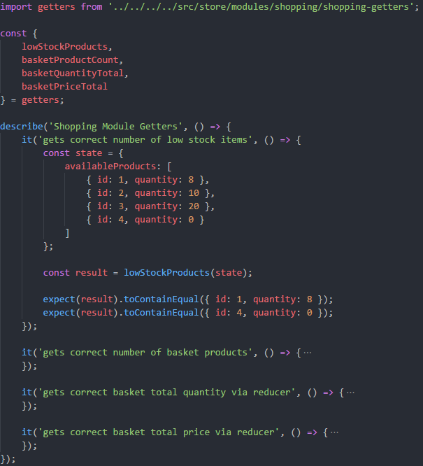

> **Warning**
> I no longer wish to work with Vue or maintain any Vue projects I have created due to growing frustration with the DX, the dev tooling situation, and it's community. Therefore this repository is unmaintained and archived.

# vue-demonstration-component-testing

A demonstration of unit testing Javascript, Vue and Vuex. Using a generic shopping basket concept for demonstration purposes.

## Plain Javascript

Unit tests
 - Asserting function return values
 - Mocking dependencies of functions - isolating them and verifying call signatures
 
## Vuex State Management

Implementation
 - State/Store ✔️
 - Mutations ✔️
 - Getters ✔️
 - Actions ✔️

Unit tests
 - State/Store ✔️
 - Mutations ✔️
 - Getters ✔️
 - Actions (including mocking of context - dispatch and commit) ✔️

## Vue Components

Implementation
 - Components

Unit tests
 - Render correct text/data ✔️
 - Render corrext text/data from props ✔️
 - Render correct text/data from Vuex store
 - DOM events (e.g. user interaction)
 - Triggering DOM events
 - Check for existence of DOM element via selector ✔️
